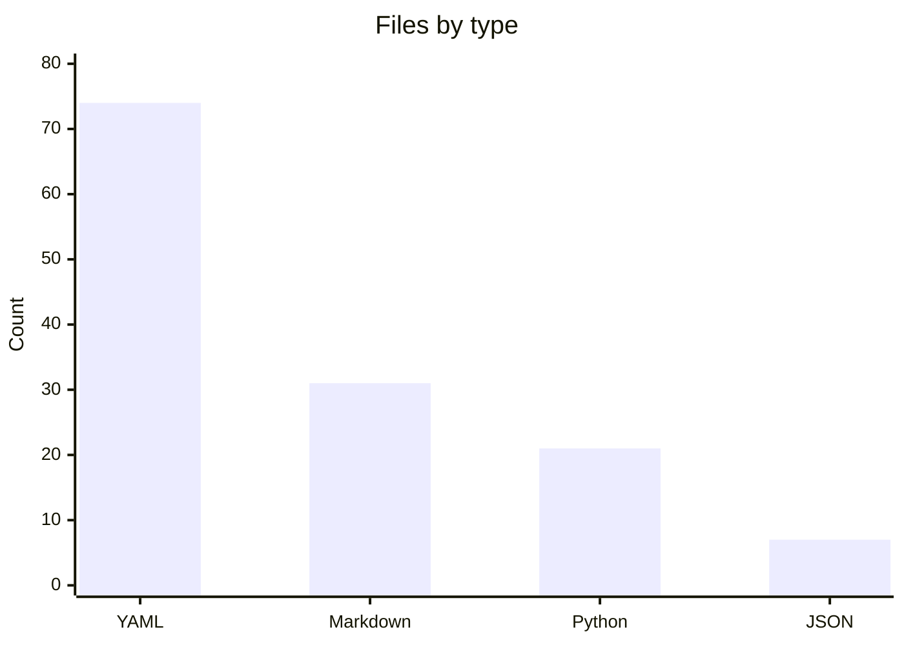
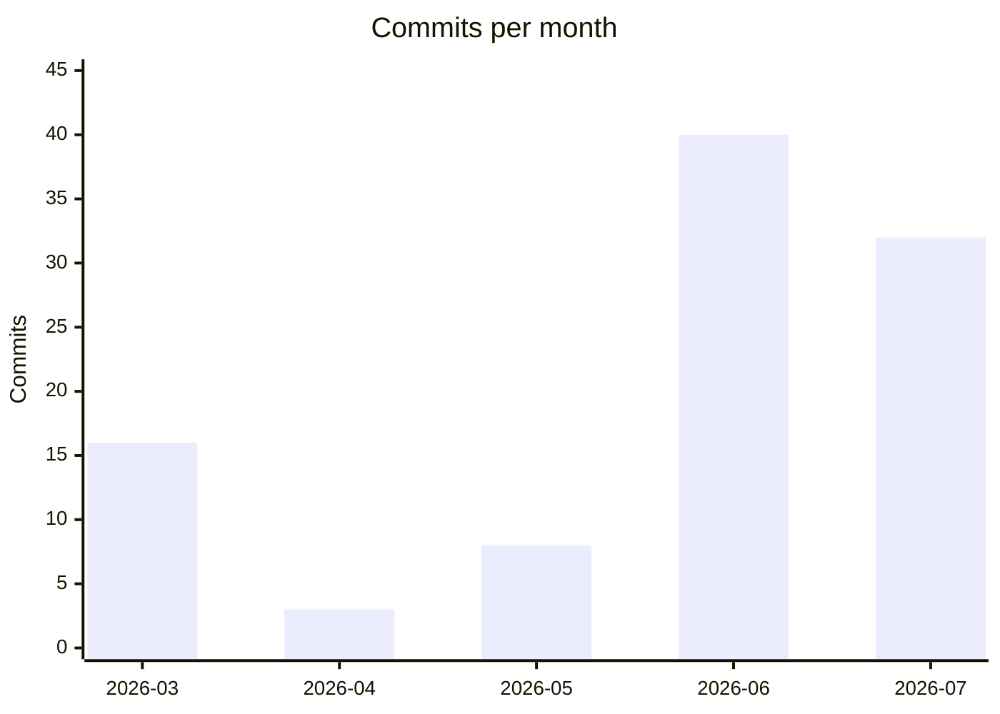

# By the numbers

Data collected on 2026-07-10.

## Repository size

| Metric | Value |
|---|---|
| Total commits (main) | 99 |
| YAML files | 74 |
| Python files | 21 |
| Markdown files | 31 |
| JSON files | 7 |
| Total tracked files (key dirs) | 100 |

### File count by directory

| Directory | Files |
|---|---|
| `graphs/` | 62 |
| `scripts/` | 19 |
| `schemas/` | 8 |
| `exports/` | 5 |
| `templates/` | 3 |
| `verification-runtime/` | 3 |
| `rules/` | 0 |
| `workflows/` | 0 |

### Lines of code by type

| Type | Lines |
|---|---|
| Python (`scripts/*.py`) | 6,578 |
| YAML (all, excl. `_archive/`) | 5,621 |
| Markdown (all, excl. `_archive/`) | 2,600 |
| YAML (`schemas/v1/`) | 381 |
| YAML (`graphs/`) | 2,983 |

### Average file size

| Type | Avg lines per file |
|---|---|
| Python | ~365 |
| YAML | ~76 |
| Markdown | ~84 |

## File type breakdown

## Activity

### Commits per month

| Month | Commits |
|---|---|
| 2026-03 | 16 |
| 2026-04 | 3 |
| 2026-05 | 8 |
| 2026-06 | 40 |
| 2026-07 | 32 |

Commits since 2026-04-01: 83 out of 99 total (84%).

### Bot-attributed commits

On the main branch, 0 of 99 commits are bot-authored. All 99 commits on main are authored by a single human contributor under three name variants (Saboor Khurshid Chaudry, Saboor, Saboor (BigPi)).

Across all branches, 1 commit is attributed to `google-labs-jules[bot]`, out of 112 total commits (0.9%). That commit ("feat(node-cli): implement keyed acceptance criteria and generate practice graphs") landed on a feature branch and has not been merged to main.

Six commits on main were committed by the "GitHub" account (PR merge commits), but all are human-authored.

## Complexity

### Largest Python files

| File | Lines |
|---|---|
| `scripts/verify_node.py` | 1,549 |
| `scripts/new_node.py` | 652 |
| `scripts/gddp.py` | 436 |
| `scripts/obsidian_export.py` | 392 |
| `scripts/graphify_to_nodes.py` | 391 |
| `scripts/validate.py` | 379 |
| `scripts/batch_fill.py` | 350 |
| `scripts/import_node.py` | 348 |
| `scripts/rapid_add.py` | 338 |

`scripts/verify_node.py` at 1,549 lines is 2.4x larger than the next file and accounts for 24% of all Python lines in `scripts/`.

### Largest YAML files

| File | Lines |
|---|---|
| `exports/shareable-graphs/gddp-runtime.yaml` | 588 |
| `exports/shareable-graphs/aa-cli.yaml` | 457 |
| `exports/shareable-graphs/vault-doctor.yaml` | 391 |
| `exports/shareable-graphs/sell-valuables.yaml` | 375 |
| `exports/shareable-graphs/album-production.yaml` | 356 |
| `graphs/gddp-runtime/project.yaml` | 109 |
| `graphs/aa-cli/project.yaml` | 87 |

The five largest YAML files are all graph bundle exports under `exports/shareable-graphs/`. The largest, `exports/shareable-graphs/gddp-runtime.yaml`, is 588 lines.

### Schema files

| File | Lines |
|---|---|
| `schemas/v1/node.yaml` | 68 |
| `schemas/v1/job.yaml` | 66 |
| `schemas/v1/event.yaml` | 63 |
| `schemas/v1/task_packet.yaml` | 51 |
| `schemas/v1/result.yaml` | 45 |
| `schemas/v1/artifact_verification.yaml` | 34 |
| `schemas/v1/queue_record.yaml` | 32 |
| `schemas/v1/shape_profile.yaml` | 22 |

All 8 schemas live under `schemas/v1/` and total 381 lines. The largest is `schemas/v1/node.yaml` at 68 lines. Schemas are compact, averaging 48 lines each.
