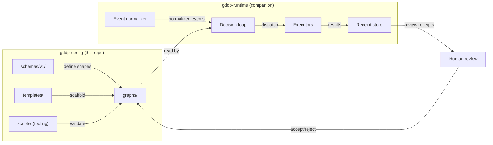
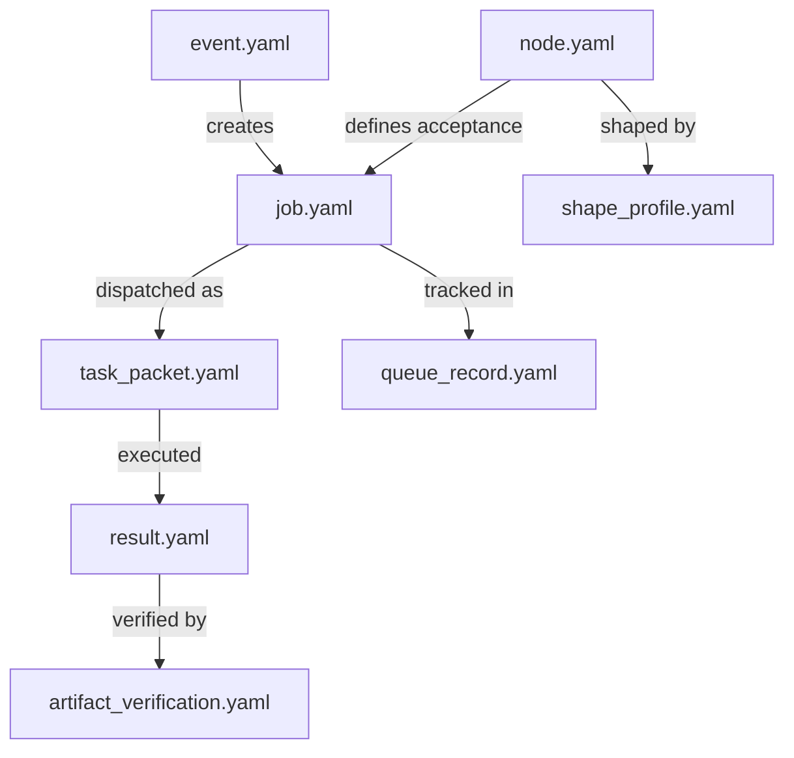

# Architecture

GDDP separates graph truth from execution. This repo (`gddp-config`) owns the declarative configs that define what projects are and what done means. The companion `gddp-runtime` repo owns the execution loop that reads those configs, dispatches executors, and produces review receipts. The boundary is strict: runtime never mutates graph truth.

## System diagram

## Data flow

The system follows a forward-path / return-path split:

1. **Forward path**: An external event (GitHub webhook, manual trigger) is normalized into an `event` (see `schemas/v1/event.yaml`). The decision loop reads the project graph, finds the next ready node, creates a `job` (`schemas/v1/job.yaml`), constructs a `task_packet` (`schemas/v1/task_packet.yaml`), and dispatches to an executor.

2. **Return path**: The executor returns a `result` (`schemas/v1/result.yaml`). The result becomes a review receipt in the receipt store. A human reviews the receipt and decides whether to advance graph truth (change node status to `complete` in `project.yaml`). The runtime never makes this decision.

3. **Verification layer**: Before a node advances, `artifact_verification` (`schemas/v1/artifact_verification.yaml`) checks that all required artifacts exist. The deterministic verifier (`scripts/verify_node.py`) can also run acceptance criteria checks against the source repo.

## Schema relationships

## Key design decisions

- **Human-owned graph truth**: Only a human can change node status to `complete`. The runtime produces evidence (receipts), not decisions.
- **Schema-validated YAML**: All configs are YAML validated against schemas in `schemas/v1/`. The validator (`scripts/validate.py`) runs as a pre-commit gate.
- **Deterministic verification first**: `scripts/verify_node.py` checks what can be mechanically proven (symbol presence, file existence, pattern matching). Semantic evaluation is a separate, later layer.
- **Branch protection**: `main` is protected. All changes go through PRs. The human is the only merge authority.

## What lives where

| Directory | Role |
|---|---|
| `schemas/v1/` | Canonical YAML schemas for all system objects (8 schemas) |
| `graphs/` | Project graphs, one folder per project (5 projects + template) |
| `templates/` | Node and job authoring templates |
| `scripts/` | Python tooling: validator, TUI scaffold, verifier, CLI, exports |
| `rules/` | Decision-loop rule configs (future, currently empty) |
| `workflows/` | Decision-loop workflow configs (future, currently empty) |
| `exports/` | Shareable one-file graph bundle exports |
| `verification-runtime/` | Deterministic evaluation receipt JSONs |
| `verification-runtime-live/` | Live evaluation receipt JSONs from pi-harness runs |
| `docs/` | Planning and runway documents |
| `.handoffs/` | Session handoff files for agent continuity |
| `.agents/` | Agent guard hooks (natural bounded autonomy) |
| `_archive/` | Archived graphify output and old handoffs |

For details on the schema system, see [Schemas](../systems/schemas.md). For the project graphs, see [Project graphs](../projects/index.md). For the CLI tools, see [CLI tooling](../systems/cli-tooling.md).
