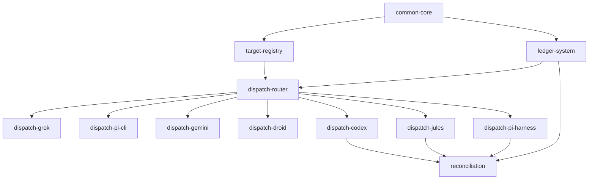

# AA CLI

AA CLI is a zsh task compiler and dispatcher that turns prompts into validated packets, routes them to executor targets, and tracks runs in a TSV ledger. It is a terminal-first dispatch shell where one keystroke fires a validated packet to the right executor and every run leaves a ledger receipt. The project graph lives in `graphs/aa-cli/` with 12 nodes, all complete.

## Blueprint

The blueprint vision from `graphs/aa-cli/project.yaml` is a terminal-first dispatch shell where one keystroke fires a validated packet to the right executor and every run leaves a ledger receipt. The architecture is a pure zsh CLI with `lib/` modules sourced from `bin/aa`. Packets are JSON validated against `schema/packet.schema.json`. A `targets.conf` file maps target names to sync or async commands, and `aa_fire_packet` in `lib/fire.zsh` is the central router. State lives under `AA_DATA_HOME` (packets) and `AA_STATE_HOME` (runs, ledger.tsv).

## Major capabilities

The blueprint documents six major capabilities, each mapped to one or more nodes:

1. **Common-core**: Shared path, init, and packet validation helpers. Every aa module depends on consistent XDG paths, directory bootstrap, jq-backed packet validation, and small string/time utilities.
2. **Target-registry**: `targets.conf` registry and `aa_target_lookup`. The single source of truth for executor routing, supporting sync and async modes with tier fallback.
3. **Ledger-system**: TSV ledger append, update, and display. Every fired packet leaves a durable ledger row so deck, reconcile, and the operator can see open, done, error, and stale runs.
4. **Dispatch-router**: `aa_fire_packet` routing and run directory setup. Validates input, composes the prompt, creates a run directory, looks up the target, and branches to the correct executor handler.
5. **Per-executor dispatch paths**: Seven executor-specific dispatch nodes covering sync targets (grok, pi-cli, gemini, droid) and async targets (codex, jules, pi-harness).
6. **Reconciliation**: `aa_reconcile` for async codex, jules, and pi-harness ledger rows. Inspects process exit or remote session status and promotes open rows to done or error.

## Nodes

All 12 nodes are complete. Each node is a YAML file in `graphs/aa-cli/nodes/`.

| Node | Title | Status | Depends on | Unlocks |
|------|-------|--------|------------|---------|
| `common-core` | Implement shared aa path, init, and packet validation helpers | complete | (none) | target-registry, ledger-system |
| `target-registry` | Implement targets.conf registry and aa_target_lookup | complete | common-core | dispatch-router |
| `ledger-system` | Implement TSV ledger append, update, and display | complete | common-core | dispatch-router, reconciliation |
| `dispatch-router` | Implement aa_fire_packet routing and run directory setup | complete | target-registry, ledger-system | all 7 dispatch nodes |
| `dispatch-grok` | Wire sync grok (grk) target dispatch | complete | dispatch-router | (none) |
| `dispatch-pi-cli` | Wire sync pi-cli (pir) target dispatch | complete | dispatch-router | (none) |
| `dispatch-gemini` | Wire sync gemini (agy) target dispatch | complete | dispatch-router | (none) |
| `dispatch-droid` | Wire sync droid target dispatch | complete | dispatch-router | (none) |
| `dispatch-codex` | Wire async codex (__codex_async) background dispatch | complete | dispatch-router | reconciliation |
| `dispatch-jules` | Wire async jules (__jules_async) remote session dispatch | complete | dispatch-router | reconciliation |
| `dispatch-pi-harness` | Wire async pi-harness (__pi_async) background dispatch | complete | dispatch-router | reconciliation |
| `reconciliation` | Implement aa_reconcile for async codex and jules ledger rows | complete | ledger-system, dispatch-codex, dispatch-jules, dispatch-pi-harness | (none) |

## Dependency graph

The graph has a clear layered structure. `common-core` is the foundation with no dependencies. `target-registry` and `ledger-system` build on it. `dispatch-router` requires both of those. The seven executor dispatch nodes fan out from `dispatch-router`. `reconciliation` sits at the top, depending on `ledger-system` and the three async dispatch nodes (codex, jules, pi-harness) whose open rows it reconciles.

## Sync vs async dispatch

The four sync dispatch nodes (grok, pi-cli, gemini, droid) run their resolved command inline with the prompt on stdin, capture output to `runs/<id>/output.log`, and record done or error in the ledger on completion. They do not track background processes.

The three async dispatch nodes (codex, jules, pi-harness) fire in the background and leave ledger rows in `open` state. Codex and pi-harness use `nohup` wrappers with pid and exit_status files. Jules creates remote sessions and stores the session id as the ledger ref. The `reconciliation` node later inspects these and promotes rows to done or error.

## Execution policy

| Field | Value |
|-------|-------|
| default_executor | jules |
| max_concurrent_jobs | 1 |
| require_human_review_before_overnight | false |
| artifact_gate_enforced | true |

## Key source files

| File | Purpose |
|------|---------|
| `graphs/aa-cli/project.yaml` | Project blueprint, node index, execution policy |
| `graphs/aa-cli/nodes/common-core.yaml` | Shared path, init, validation helpers node |
| `graphs/aa-cli/nodes/target-registry.yaml` | targets.conf registry and lookup node |
| `graphs/aa-cli/nodes/ledger-system.yaml` | TSV ledger append, update, display node |
| `graphs/aa-cli/nodes/dispatch-router.yaml` | Central fire routing and run directory node |
| `graphs/aa-cli/nodes/dispatch-grok.yaml` | Sync grok dispatch node |
| `graphs/aa-cli/nodes/dispatch-pi-cli.yaml` | Sync pi-cli dispatch node |
| `graphs/aa-cli/nodes/dispatch-gemini.yaml` | Sync gemini dispatch node |
| `graphs/aa-cli/nodes/dispatch-droid.yaml` | Sync droid dispatch node |
| `graphs/aa-cli/nodes/dispatch-codex.yaml` | Async codex background dispatch node |
| `graphs/aa-cli/nodes/dispatch-jules.yaml` | Async jules remote session dispatch node |
| `graphs/aa-cli/nodes/dispatch-pi-harness.yaml` | Async pi-harness background dispatch node |
| `graphs/aa-cli/nodes/reconciliation.yaml` | Async ledger row reconciliation node |

## Related pages

- [projects/index.md](index.md): Overview of all project graphs
- [systems/graph-engine.md](../systems/graph-engine.md): How project graphs work
- [features/project-bootstrapping.md](../features/project-bootstrapping.md): Project creation flows
