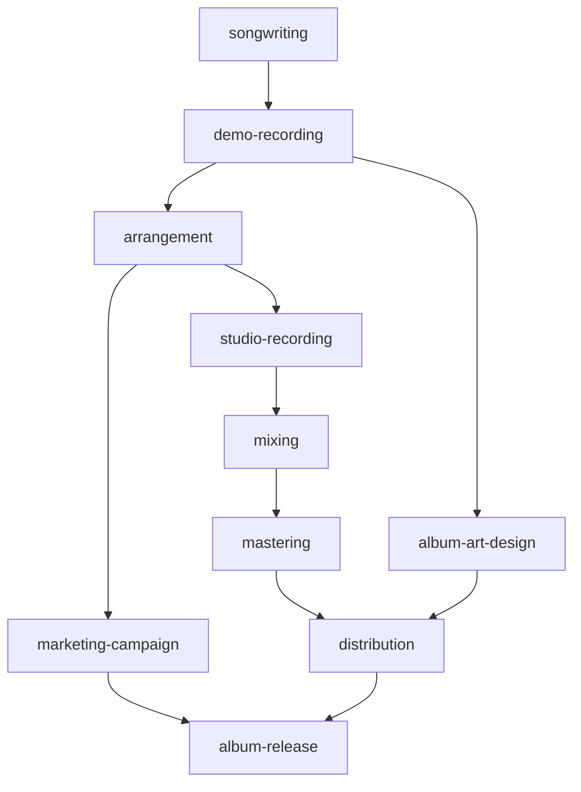

# Album Production

Album Production is an end-to-end pipeline from songwriting through mastering, artwork, marketing, distribution, and release. It models a cohesive album release where audio production, visual identity, and marketing launch in sync on release day. The project graph lives in `graphs/album-production/` with 10 nodes, all pending.

## Blueprint

The blueprint vision from `graphs/album-production/project.yaml` is to ship a cohesive album release where audio production, visual identity, and marketing launch in sync on release day. The architecture is a linear audio chain (songwriting to demo to arrangement to studio to mix to master) with parallel tracks branching after demo (art) and after arrangement (marketing). Distribution gates on mastered audio and final artwork. Release gates on distribution plus live campaign assets. Each phase produces reviewable artifacts on disk before the next phase starts.

## Major capabilities

The blueprint documents five major capabilities:

1. **Songwriting and demo capture**: Locking the track list, lyrics, chord charts, and album concept, then recording reference demos for every track.
2. **Arrangement and studio tracking**: Finalizing instrument parts, section maps, and click tracks, then capturing final studio performances as multitrack stems.
3. **Mixing and mastering deliverables**: Mixing all tracks to approved reference balances, then mastering to distribution-ready loudness and format specs.
4. **Album art and marketing campaign**: Delivering final cover art and packaging assets, and building a pre-release marketing campaign with a content calendar.
5. **Distribution setup and public release**: Uploading masters and metadata to a distribution aggregator, then executing a coordinated release day launch.

## Nodes

All 10 nodes are pending. Each node is a YAML file in `graphs/album-production/nodes/`.

| Node | Title | Status | Depends on | Unlocks |
|------|-------|--------|------------|---------|
| `songwriting` | Complete album songwriting and lyric lock | pending | (none) | demo-recording |
| `demo-recording` | Record reference demos for every album track | pending | songwriting | arrangement, album-art-design |
| `arrangement` | Finalize arrangements and studio session plans | pending | demo-recording | studio-recording, marketing-campaign |
| `studio-recording` | Track final studio performances for all album songs | pending | arrangement | mixing |
| `mixing` | Mix all album tracks to approved reference balances | pending | studio-recording | mastering |
| `mastering` | Master album tracks to distribution-ready loudness and format | pending | mixing | distribution |
| `album-art-design` | Deliver final album artwork and packaging assets | pending | demo-recording | distribution |
| `marketing-campaign` | Build pre-release marketing campaign and content calendar | pending | arrangement | album-release |
| `distribution` | Upload masters and metadata to distribution aggregator | pending | mastering, album-art-design | album-release |
| `album-release` | Execute coordinated album release day launch | pending | distribution, marketing-campaign | (none) |

## Dependency graph

The diagram below shows the linear audio chain with parallel art and marketing tracks branching off, and the two gate nodes (distribution and release) where the tracks converge.

The graph has three structural elements:

1. **Linear audio chain**: `songwriting` to `demo-recording` to `arrangement` to `studio-recording` to `mixing` to `mastering` to `distribution`. This is the spine of the project. Each phase produces reviewable artifacts before the next starts.

2. **Parallel art track**: `album-art-design` branches off after `demo-recording` and runs in parallel with the audio chain. It converges at `distribution`, which gates on both mastered audio and final artwork.

3. **Parallel marketing track**: `marketing-campaign` branches off after `arrangement` and runs in parallel with the later audio chain. It converges at `album-release`, which gates on both distribution and the live campaign.

## Gate nodes

Two nodes serve as convergence gates where parallel tracks must both be satisfied:

- **distribution**: Depends on `mastering` (audio chain) and `album-art-design` (art track). Masters and cover art must both be ready before upload to the aggregator.
- **album-release**: Depends on `distribution` and `marketing-campaign`. The album must be live on distribution platforms and the marketing campaign must be activated on the same day.

## Execution policy

| Field | Value |
|-------|-------|
| default_executor | jules |
| max_concurrent_jobs | 1 |
| require_human_review_before_overnight | true |
| artifact_gate_enforced | true |

## Key source files

| File | Purpose |
|------|---------|
| `graphs/album-production/project.yaml` | Project blueprint, node index, execution policy |
| `graphs/album-production/nodes/songwriting.yaml` | Songwriting and lyric lock node |
| `graphs/album-production/nodes/demo-recording.yaml` | Reference demo recording node |
| `graphs/album-production/nodes/arrangement.yaml` | Arrangement and session plan node |
| `graphs/album-production/nodes/studio-recording.yaml` | Studio performance tracking node |
| `graphs/album-production/nodes/mixing.yaml` | Mixing node |
| `graphs/album-production/nodes/mastering.yaml` | Mastering node |
| `graphs/album-production/nodes/album-art-design.yaml` | Album artwork and packaging node |
| `graphs/album-production/nodes/marketing-campaign.yaml` | Marketing campaign and content calendar node |
| `graphs/album-production/nodes/distribution.yaml` | Distribution aggregator upload node |
| `graphs/album-production/nodes/album-release.yaml` | Coordinated release day launch node |

## Related pages

- [projects/index.md](index.md): Overview of all project graphs
- [systems/graph-engine.md](../systems/graph-engine.md): How project graphs work
- [overview/glossary.md](../overview/glossary.md): GDDP vocabulary
