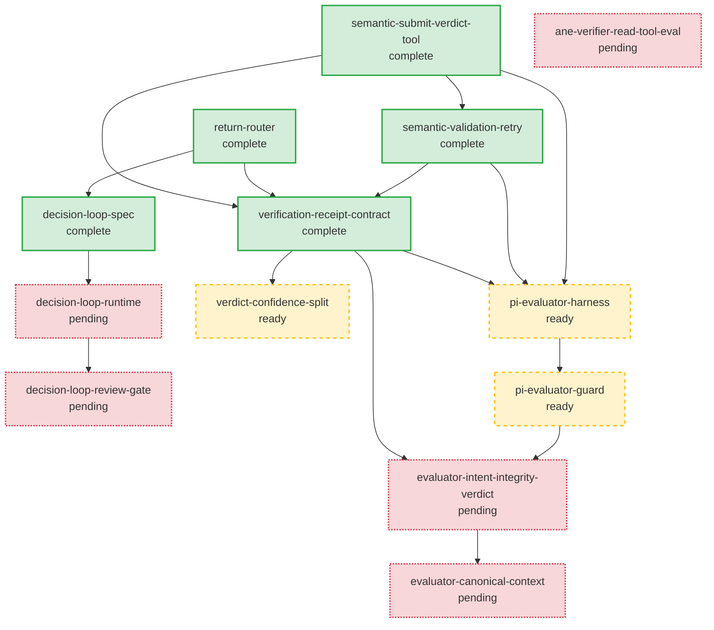

# GDDP Runtime Engine

The GDDP Runtime Engine is the control plane that dispatches executors and turns their outputs into reviewable receipts while keeping graph truth human-owned. It is the most complex project graph in the repository, with 13 nodes spanning the return path, decision loop, semantic verification harness, and evaluator contract evolution. The project graph lives in `graphs/gddp-runtime/`.

## Blueprint

The blueprint vision from `graphs/gddp-runtime/project.yaml` is a self-operating control plane where the forward dispatch loop runs autonomously while the return path stays reviewable, never letting runtime mutate project truth. The key architectural invariant is that `gddp-runtime` is the execution engine, while graph truth lives in `gddp-config` and is human-owned. The forward loop (read graph, dispatch executor) already works. The return path must remain operationally useful without allowing runtime to write completion state into `project.yaml`. Merged PRs and executor outputs become review receipts (SQLite results store), and matching jobs move into `awaiting_review`. A decision loop reasons over events and a lightweight review gate evaluates PRs before a node is accepted, but graph mutation stays a human decision.

## Major capabilities

The blueprint documents thirteen major capabilities, each mapped to a node:

1. **Return router**: Merged PR creates a review receipt. Runtime parses node/job metadata, validates linkage, writes a structured result receipt to SQLite, and moves the matching job into `awaiting_review`. No graph mutation.
2. **Decision loop v0 spec**: Defines purpose, trigger model, context window, decision logic, the four powers (dispatch_next, review_pr, accept_node, escalate), output format, failure modes, and human escalation rules.
3. **Decision loop v0 runtime**: Event-driven reasoning module that wakes on webhook or cron trigger, reads graph and SQLite state, makes one decision per cycle, acts, writes a result row, and exits.
4. **Decision loop v0 review gate**: Lightweight PR evaluation before accepting a node. Checks expected files, forbidden paths, metadata block, and CI status. Posts review comments with feedback on failure.
5. **Semantic submit verdict tool**: Makes the semantic verdict a terminal tool call (`submit_verdict`) instead of free-text JSON, so weak models self-terminate and the verdict arrives as a validated payload.
6. **Semantic validation retry**: Re-prompts the model on invalid verdict output instead of failing the receipt. Bounded retries with budget accounting.
7. **Verifier receipt contract**: Separates criteria satisfaction, execution-trail completeness, graph-advance readiness, and next-action signals into a structured receipt shape.
8. **Verdict confidence split**: Splits verdict confidence into `criteria_confidence` and `completeness` so the score is trustable. An indeterminate deterministic floor no longer drags a confident semantic result below its level.
9. **Pi evaluator harness**: Drives the semantic evaluator through the pi coding agent for live, streaming visibility into the investigation while preserving every GDDP contract.
10. **Pi evaluator guard**: Mechanistic enforcement layer with broad inputs and enforced outputs. The model gets broad tool access, but write-capable tools, destructive bash, git mutations, and network are hard-blocked at the harness level.
11. **Evaluator intent/integrity verdict**: Graduates the verdict from criteria satisfaction to intent preservation and graph integrity. Adds `intent_preserved`, `graph_integrity_preserved`, and a richer verdict enum including `drift` and `contradicted`.
12. **Evaluator canonical context**: Feeds the evaluator canonical docs (README, PROJECT-BRIEF, foundational node) plus the DAG neighborhood instead of AGENTS.md, so the evaluator can judge project-level intent rather than local criteria only.
13. **ANE verifier read evaluation**: Evaluates ANE exec-mode read/navigation chords as potential verifier read tooling, offering structural, low-token code reads as an alternative to `read_file` and `grep_code`.

## Nodes

The 13 nodes have mixed statuses: 5 complete, 3 ready, 5 pending. Each node is a YAML file in `graphs/gddp-runtime/nodes/`.

| Node | Title | Status | Depends on | Unlocks |
|------|-------|--------|------------|---------|
| `return-router` | Implement return router, merged PR creates review receipt | complete | (none) | decision-loop-spec |
| `decision-loop-spec` | Write decision loop v0 spec | complete | return-router | decision-loop-runtime |
| `decision-loop-runtime` | Build decision loop v0 runtime | pending | decision-loop-spec | decision-loop-review-gate |
| `decision-loop-review-gate` | Build decision loop v0 review gate | pending | decision-loop-runtime | (none) |
| `semantic-submit-verdict-tool` | Make semantic verdict a terminal tool call | complete | (none) | semantic-validation-retry |
| `semantic-validation-retry` | Re-prompt on invalid verdict output | complete | semantic-submit-verdict-tool | verification-receipt-contract |
| `verification-receipt-contract` | Define verifier receipt contract | complete | return-router, semantic-submit-verdict-tool, semantic-validation-retry | verdict-confidence-split |
| `verdict-confidence-split` | Split verdict confidence into criteria and completeness | ready | verification-receipt-contract | (none) |
| `pi-evaluator-harness` | Drive evaluator through pi coding agent | ready | semantic-submit-verdict-tool, semantic-validation-retry, verification-receipt-contract | pi-evaluator-guard |
| `pi-evaluator-guard` | Mechanistic enforcement layer for evaluator | ready | pi-evaluator-harness | evaluator-intent-integrity-verdict |
| `evaluator-intent-integrity-verdict` | Graduate verdict to intent and integrity | pending | pi-evaluator-guard, verification-receipt-contract | evaluator-canonical-context |
| `evaluator-canonical-context` | Feed evaluator canonical docs and DAG neighborhood | pending | evaluator-intent-integrity-verdict | (none) |
| `ane-verifier-read-tool-eval` | Evaluate ANE exec read/navigation chords | pending | (none) | (none) |

## Dependency graph

The diagram below shows node dependencies with status indicated by node style. Completed nodes have a solid border, ready nodes have a dashed border, and pending nodes have a dotted border.

The graph has three main branches that converge on the evaluator evolution path:

1. **Decision loop branch**: `return-router` to `decision-loop-spec` to `decision-loop-runtime` to `decision-loop-review-gate`. This branch builds the autonomous reasoning brain. The spec is complete, but the runtime and review gate are pending.

2. **Semantic harness branch**: `semantic-submit-verdict-tool` to `semantic-validation-retry` to `verification-receipt-contract`. This branch hardens the verifier's output path. All three nodes are complete. The contract node also depends on `return-router`, tying the two branches together.

3. **Evaluator evolution branch**: `pi-evaluator-harness` to `pi-evaluator-guard` to `evaluator-intent-integrity-verdict` to `evaluator-canonical-context`. This branch upgrades the evaluator from criteria checking to intent and graph integrity judgment. The harness and guard are ready, while the verdict upgrade and canonical context are pending.

The `ane-verifier-read-tool-eval` node is independent with no dependencies or unlocks. It is a bounded, abandonable evaluation spike.

## Completed work

Five nodes are complete, covering the return path foundation and the semantic harness backbone:

- **return-router**: Merged PRs create review receipts in SQLite without mutating graph truth. Validates repo allowlist, parses node and job metadata from PR body, and moves matching jobs to `awaiting_review`.
- **decision-loop-spec**: A single markdown spec defining the decision loop contract, the four powers, failure modes, and v0 scope limits.
- **semantic-submit-verdict-tool**: The semantic verdict is now a `submit_verdict` terminal tool call. The agent loop terminates on submit, and a forced-conclusion instruction fires when the budget is nearly exhausted. A free-text fallback is retained for safety.
- **semantic-validation-retry**: Invalid verdict output triggers a corrective re-prompt with bounded retries (default 2), turning transient format drift into a self-correcting step instead of a wasted run.
- **verification-receipt-contract**: The receipt shape is locked with separated signals: criteria satisfaction, execution-trail completeness, graph-advance readiness, and next-action vocabulary. Fixtures cover ambiguity cases, and schema tests enforce compatibility.

## Ready work

Three nodes are ready for execution:

- **verdict-confidence-split**: Fixes a calibration bug where an indeterminate deterministic floor overrode confident semantic judgments. The blend will defer to semantic confidence when the floor is indeterminate-dominated, and `criteria_confidence` will be reported independently from completeness gating.
- **pi-evaluator-harness**: Wires the pi coding agent as an alternative semantic harness, giving live streaming visibility while preserving the typed `submit_verdict` tool, the decision engine matrix, and the receipt contract.
- **pi-evaluator-guard**: Adds a mechanistic tool_call hook that hard-blocks write-capable tools, destructive bash, git mutations, and network, while logging every tool call to a trace file. The model is not asked to behave; the harness refuses.

## Pending work

Five nodes are pending:

- **decision-loop-runtime**: The event-driven reasoning module. Wakes on webhook or cron, reads context, makes one decision, acts, writes a result row, exits. Implements `dispatch_next` and `escalate` powers.
- **decision-loop-review-gate**: Implements `review_pr` and `accept_node` powers. Structural checks (files, paths, metadata, CI status) before accepting a node.
- **evaluator-intent-integrity-verdict**: Upgrades the verdict contract with `intent_preserved`, `graph_integrity_preserved`, and a richer verdict enum. A node that passes criteria but damages the project graph yields a `drift` or `contradicted` verdict.
- **evaluator-canonical-context**: Builds a context assembler that feeds the evaluator canonical docs and the DAG neighborhood instead of AGENTS.md, enabling legitimate intent and integrity judgments.
- **ane-verifier-read-tool-eval**: A spike evaluating ANE exec-mode structural code reads as a low-token alternative to `read_file` and `grep_code`. A no-go recommendation fully satisfies the node.

## Execution policy

| Field | Value |
|-------|-------|
| default_executor | jules |
| max_concurrent_jobs | 1 |
| require_human_review_before_overnight | false |
| artifact_gate_enforced | true |

## Key source files

| File | Purpose |
|------|---------|
| `graphs/gddp-runtime/project.yaml` | Project blueprint, node index, execution policy |
| `graphs/gddp-runtime/nodes/return-router.yaml` | Return router, merged PR review receipt node |
| `graphs/gddp-runtime/nodes/decision-loop-spec.yaml` | Decision loop v0 spec node |
| `graphs/gddp-runtime/nodes/decision-loop-runtime.yaml` | Decision loop v0 runtime node |
| `graphs/gddp-runtime/nodes/decision-loop-review-gate.yaml` | Decision loop v0 review gate node |
| `graphs/gddp-runtime/nodes/semantic-submit-verdict-tool.yaml` | Semantic verdict terminal tool node |
| `graphs/gddp-runtime/nodes/semantic-validation-retry.yaml` | Semantic validation retry node |
| `graphs/gddp-runtime/nodes/verification-receipt-contract.yaml` | Verifier receipt contract node |
| `graphs/gddp-runtime/nodes/verdict-confidence-split.yaml` | Verdict confidence split node |
| `graphs/gddp-runtime/nodes/pi-evaluator-harness.yaml` | Pi evaluator harness node |
| `graphs/gddp-runtime/nodes/pi-evaluator-guard.yaml` | Pi evaluator guard node |
| `graphs/gddp-runtime/nodes/evaluator-intent-integrity-verdict.yaml` | Evaluator intent and integrity verdict node |
| `graphs/gddp-runtime/nodes/evaluator-canonical-context.yaml` | Evaluator canonical context node |
| `graphs/gddp-runtime/nodes/ane-verifier-read-tool-eval.yaml` | ANE verifier read tool evaluation node |

## Related pages

- [projects/index.md](index.md): Overview of all project graphs
- [systems/graph-engine.md](../systems/graph-engine.md): How project graphs work
- [systems/schemas.md](../systems/schemas.md): The schema system
- [overview/glossary.md](../overview/glossary.md): GDDP vocabulary
