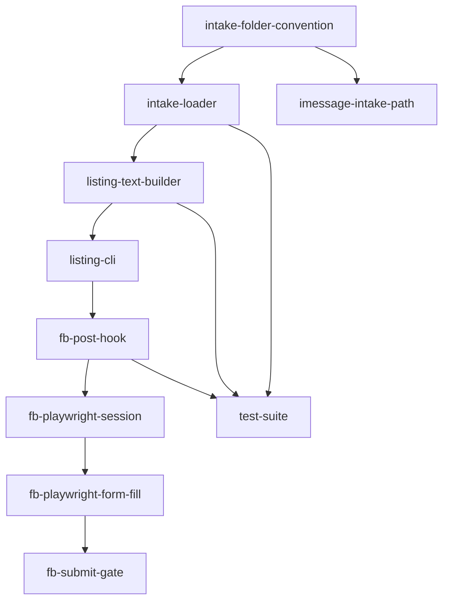

# Sell Valuables Pipeline

The Sell Valuables Pipeline turns iMessage intake folders into Facebook Marketplace listings with minimal operator friction. Photos and descriptions arrive via iMessage, get organized into folder-based intake, and flow through listing generation and browser automation hooks to a marketplace post. The project graph lives in `graphs/sell-valuables/` with 10 nodes, all pending.

## Blueprint

The blueprint vision from `graphs/sell-valuables/project.yaml` is to turn junk-removal finds into local marketplace listings with minimal operator friction. The architecture is folder-based: intake lives under `incoming/<item-id>/` with `description.txt`, optional `meta.yaml`, and a `photos/` directory. The core is Python CLI scripts (`sell-listing`, `sell-post-fb`), not a monolithic app. Facebook Marketplace has no public API, so browser automation lives behind explicit hooks with `dry_run` before submit. One item per folder, and listing evidence is `listing.md` written beside intake files.

## Major capabilities

The blueprint documents six major capabilities:

1. **Intake folder convention and ItemIntake loader**: Documents the `incoming/<item-id>/` layout with `description.txt`, `photos/`, and optional `meta.yaml`. The `ItemIntake` dataclass and `load_item` function provide a single typed loader.
2. **Listing title/body/markdown generation**: Pure functions (`build_title`, `build_body`, `build_listing_markdown`) derive marketplace-ready text from `ItemIntake` without hand-editing.
3. **sell-listing CLI**: A one-command path from an intake folder to an on-disk `listing.md` artifact. Accepts an item id, auto-selects a single candidate when omitted, and supports `--incoming` override for fixtures.
4. **Facebook post hook and Playwright session/form-fill path**: `sell-post-fb` regenerates the listing, then either opens the browser manually or invokes Playwright automation. Playwright bootstraps a session with persisted `storage_state.json`, fills the Marketplace create form, and stops before submit in dry-run mode.
5. **iMessage-to-folder operator workflow**: Documents the manual v0 path from iMessage photos to `incoming/` folders, with recommended Apple Shortcuts automation and notes on Twilio and BlueBubbles as heavier later options.
6. **pytest coverage**: Test suite covering the intake loader and listing builders against a stable fixture, without requiring Playwright or live Facebook access.

## Nodes

All 10 nodes are pending. Each node is a YAML file in `graphs/sell-valuables/nodes/`.

| Node | Title | Status | Depends on | Unlocks |
|------|-------|--------|------------|---------|
| `intake-folder-convention` | Document and enforce incoming folder layout convention | pending | (none) | intake-loader, imessage-intake-path |
| `intake-loader` | Implement ItemIntake dataclass and load_item | pending | intake-folder-convention | listing-text-builder, test-suite |
| `listing-text-builder` | Implement build_title, build_body, and build_listing_markdown | pending | intake-loader | listing-cli, test-suite |
| `listing-cli` | Implement sell-listing CLI that writes listing.md | pending | listing-text-builder | fb-post-hook |
| `fb-post-hook` | Implement sell-post-fb CLI hook with listing generation and browser open | pending | listing-cli | fb-playwright-session, test-suite |
| `fb-playwright-session` | Implement Playwright session bootstrap with storage_state.json | pending | fb-post-hook | fb-playwright-form-fill |
| `fb-playwright-form-fill` | Wire Playwright Marketplace create form fill from ItemIntake | pending | fb-playwright-session | fb-submit-gate |
| `fb-submit-gate` | Add explicit human-reviewed submit gate before Publish click | pending | fb-playwright-form-fill | (none) |
| `imessage-intake-path` | Document iMessage and Shortcuts path into incoming folders | pending | intake-folder-convention | (none) |
| `test-suite` | Add pytest coverage for intake loader and listing builders | pending | intake-loader, listing-text-builder, fb-post-hook | (none) |

## Dependency graph

The graph has two branches from `intake-folder-convention`. The main chain is a linear pipeline: intake convention to loader to listing builder to listing CLI to FB post hook, then into the Playwright automation chain (session, form-fill, submit gate). A parallel documentation branch goes to `imessage-intake-path`. The `test-suite` node depends on three nodes across the main chain (intake-loader, listing-text-builder, fb-post-hook) and validates them with pytest coverage.

## Safety design

The pipeline is designed so that no live posting can happen by accident. The `fb-submit-gate` node enforces that `dry_run` defaults to `True`, the `sell-post-fb --playwright` flag always passes `dry_run=True`, and the `submitted` flag stays `False` until an explicit submit gate is implemented and tested. A `decision.md` approving the selector map must be merged before `dry_run=False` is enabled. The project's execution policy sets `require_human_review_before_overnight` to `true`.

## Execution policy

| Field | Value |
|-------|-------|
| default_executor | jules |
| max_concurrent_jobs | 1 |
| require_human_review_before_overnight | true |
| artifact_gate_enforced | true |

## Key source files

| File | Purpose |
|------|---------|
| `graphs/sell-valuables/project.yaml` | Project blueprint, node index, execution policy |
| `graphs/sell-valuables/nodes/intake-folder-convention.yaml` | Incoming folder layout convention node |
| `graphs/sell-valuables/nodes/intake-loader.yaml` | ItemIntake dataclass and load_item node |
| `graphs/sell-valuables/nodes/listing-text-builder.yaml` | Listing title, body, and markdown builder node |
| `graphs/sell-valuables/nodes/listing-cli.yaml` | sell-listing CLI node |
| `graphs/sell-valuables/nodes/fb-post-hook.yaml` | sell-post-fb CLI hook node |
| `graphs/sell-valuables/nodes/fb-playwright-session.yaml` | Playwright session bootstrap node |
| `graphs/sell-valuables/nodes/fb-playwright-form-fill.yaml` | Playwright form fill node |
| `graphs/sell-valuables/nodes/fb-submit-gate.yaml` | Human-reviewed submit gate node |
| `graphs/sell-valuables/nodes/imessage-intake-path.yaml` | iMessage and Shortcuts path node |
| `graphs/sell-valuables/nodes/test-suite.yaml` | pytest coverage node |

## Related pages

- [projects/index.md](index.md): Overview of all project graphs
- [systems/graph-engine.md](../systems/graph-engine.md): How project graphs work
- [features/project-bootstrapping.md](../features/project-bootstrapping.md): Project creation flows
