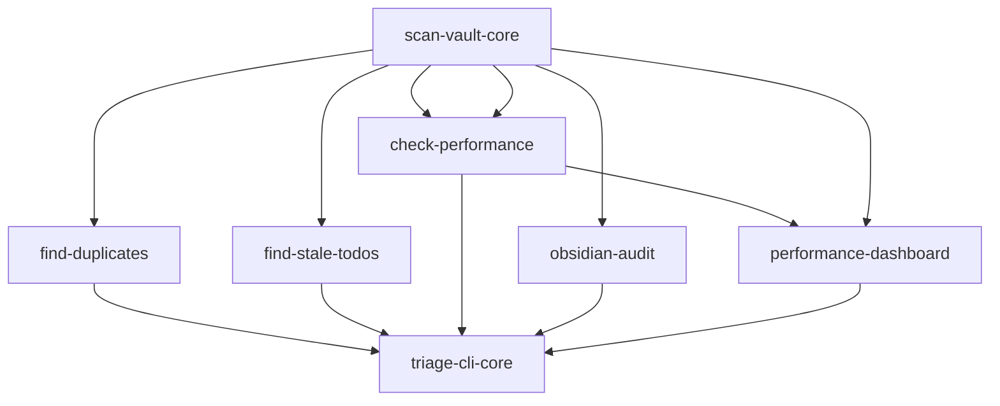

# Vault Doctor

Vault Doctor is a Python CLI tool that scans, triages, and prescribes fixes for Obsidian vaults. It gives vaults a health check and lets users act on the results through an interactive terminal session. The project graph lives in `graphs/vault-doctor/` with 7 nodes, all complete.

## Blueprint

The blueprint vision from `graphs/vault-doctor/project.yaml` is a terminal-first tool that gives Obsidian vaults a health check and lets users act on the results. The architecture is a pure Python CLI with two core modules: `doctor.py` (analysis) and `triage.py` (interactive actions). `doctor.py` is the foundation, as all triage features depend on `scan_vault()` being implemented first. The tool uses `rich` for terminal output, `python-frontmatter` for YAML parsing, and `pyyaml` for config. A mock vault in `vault_doctor/mock_vault/` provides test fixtures.

## Major capabilities

The blueprint documents five major capabilities:

1. **Vault scanning**: `scan_vault()` walks the directory tree and returns structured file metadata (path, size_bytes, extension, modified_at). This is the foundation every other analysis feature builds on.
2. **Duplicate detection**: `find_duplicates()` computes MD5 hashes for each file and returns groups of content-identical files.
3. **Stale TODO identification**: `find_stale_todos()` parses frontmatter to find notes with TODO tags that have not been modified in over 2 years (configurable via `stale_days`).
4. **Performance check**: `check_performance()` aggregates file data into a report with total file count, large files over 5MB, and plugin count from `.obsidian/plugins/`.
5. **Interactive triage CLI**: An interactive terminal session that shows findings, lets users choose actions (review duplicates, review stale TODOs), and confirms before any destructive operation. Supports `--dry-run` to suppress all file writes.

Two capabilities are implemented across multiple nodes. The `.obsidian` folder audit (`obsidian-audit`) inspects plugin configs, themes, hotkeys, and process detection. The performance dashboard (`performance-dashboard`) renders a rich-formatted terminal view of vault health.

## Nodes

All 7 nodes are complete. Each node is a YAML file in `graphs/vault-doctor/nodes/`.

| Node | Title | Status | Depends on | Unlocks |
|------|-------|--------|------------|---------|
| `scan-vault-core` | Implement VaultDoctor scan_vault foundation | complete | (none) | find-duplicates, find-stale-todos, check-performance |
| `find-duplicates` | Implement duplicate file detection | complete | scan-vault-core | triage-cli-core |
| `find-stale-todos` | Implement stale TODO identification | complete | scan-vault-core | triage-cli-core |
| `check-performance` | Implement vault performance check | complete | scan-vault-core | triage-cli-core |
| `obsidian-audit` | Implement .obsidian folder audit and process detection | complete | scan-vault-core | triage-cli-core |
| `performance-dashboard` | Implement live performance dashboard | complete | scan-vault-core, check-performance | triage-cli-core |
| `triage-cli-core` | Implement interactive triage CLI | complete | find-duplicates, find-stale-todos, check-performance, obsidian-audit, performance-dashboard | (none) |

## Dependency graph

The graph has a hub-and-spoke structure. `scan-vault-core` is the single root with no dependencies. Five analysis nodes depend on it: `find-duplicates`, `find-stale-todos`, `check-performance`, `obsidian-audit`, and `performance-dashboard` (which also depends on `check-performance`). `triage-cli-core` sits at the top, depending on all five analysis nodes, since the interactive CLI needs every feature's output to present actionable findings to the user.

## Execution policy

| Field | Value |
|-------|-------|
| default_executor | jules |
| max_concurrent_jobs | 1 |
| require_human_review_before_overnight | false |
| artifact_gate_enforced | true |

## Key source files

| File | Purpose |
|------|---------|
| `graphs/vault-doctor/project.yaml` | Project blueprint, node index, execution policy |
| `graphs/vault-doctor/nodes/scan-vault-core.yaml` | VaultDoctor scan_vault foundation node |
| `graphs/vault-doctor/nodes/find-duplicates.yaml` | Duplicate file detection node |
| `graphs/vault-doctor/nodes/find-stale-todos.yaml` | Stale TODO identification node |
| `graphs/vault-doctor/nodes/check-performance.yaml` | Vault performance check node |
| `graphs/vault-doctor/nodes/obsidian-audit.yaml` | .obsidian folder audit and process detection node |
| `graphs/vault-doctor/nodes/performance-dashboard.yaml` | Live performance dashboard node |
| `graphs/vault-doctor/nodes/triage-cli-core.yaml` | Interactive triage CLI node |

## Related pages

- [projects/index.md](index.md): Overview of all project graphs
- [systems/graph-engine.md](../systems/graph-engine.md): How project graphs work
- [systems/schemas.md](../systems/schemas.md): The schema system
