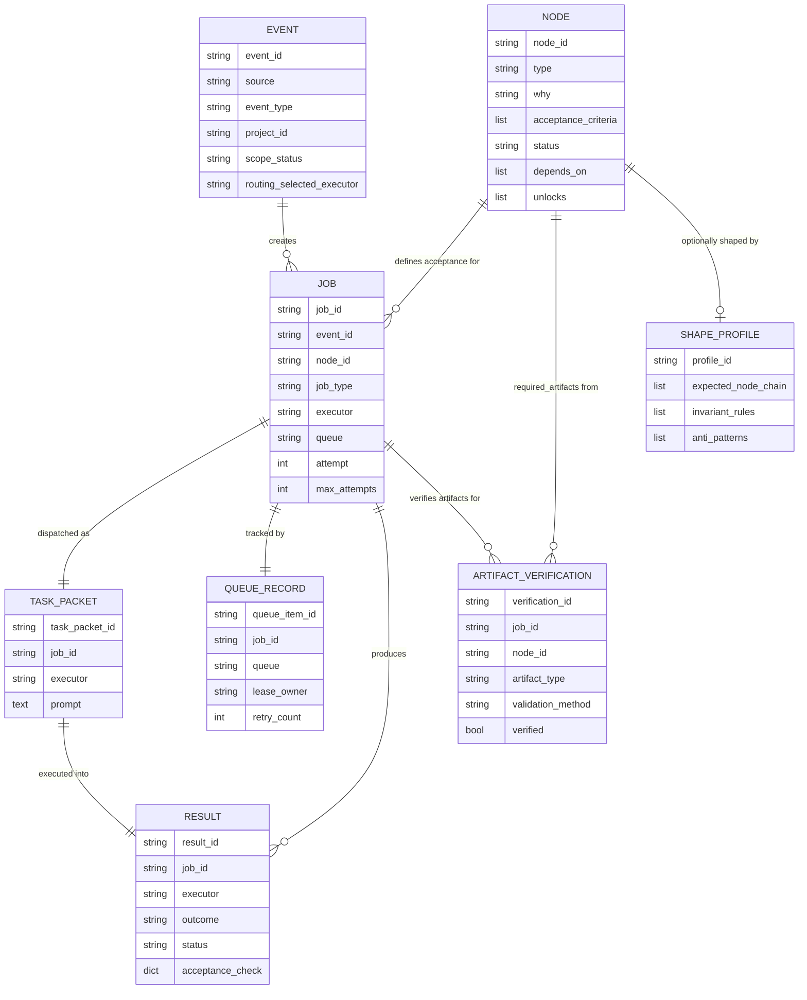

# Data models

The 8 schemas in `schemas/v1/` define the data model for GDDP. They relate through a forward-path (event to job to executor) and a return-path (result to verification to human review). This page documents how the schemas connect.

## Schema inventory

| Schema | File | Role |
|---|---|---|
| Event | `schemas/v1/event.yaml` | Something that happened. Normalized from webhooks before routing. |
| Node | `schemas/v1/node.yaml` | A capability, milestone, or constraint. Defines acceptance criteria. |
| Job | `schemas/v1/job.yaml` | Bounded work derived from an event and a node. |
| Task packet | `schemas/v1/task_packet.yaml` | The exact payload sent to an executor. Archived regardless of outcome. |
| Result | `schemas/v1/result.yaml` | What an executor returns. Contains acceptance check and risks. |
| Queue record | `schemas/v1/queue_record.yaml` | SQLite record tracking job lifecycle and leasing. |
| Artifact verification | `schemas/v1/artifact_verification.yaml` | Hard gate: all required artifacts must verify before node advancement. |
| Shape profile | `schemas/v1/shape_profile.yaml` | Optional structural context for the semantic verification agent. |

## Relationships

The data model follows a pipeline:

1. An **event** arrives (GitHub webhook, manual trigger, transcript). It is normalized and classified.
2. The decision loop reads the project graph, finds the next ready **node**, and creates a **job** from the event and node.
3. The job is tracked by a **queue record** through its lifecycle (intake, classified, ready, running, awaiting_result, awaiting_review, complete, failed).
4. A **task packet** is constructed from the job and dispatched to an executor.
5. The executor returns a **result** with changed files, acceptance check, and risks.
6. Each required artifact in the result is verified by an **artifact verification** record. All must pass before the node advances.
7. A human reviews the result and decides whether to advance graph truth (change node status to `complete`).
8. A **shape profile** can provide optional structural context to the semantic verification agent. It does not mutate graph truth.

## ER-style diagram

## Key relationship details

### Event to job (one-to-many)

One event can create zero, one, or multiple jobs. The event carries `project_node_candidates` listing which nodes might be relevant. The decision loop determines which nodes to dispatch.

### Node to job (one-to-many)

A node defines acceptance criteria. When a job is created for a node, the job copies the node's acceptance criteria (referencing them by `node_ref` and `acceptance_ids`). The job must not weaken the node's acceptance criteria.

### Job to queue record (one-to-one)

Each job has a queue record in SQLite for lifecycle tracking. The queue record handles leasing (preventing two workers from picking up the same job) and retry counting.

### Job to task packet (one-to-one)

The task packet is the exact payload constructed before dispatch. It is archived in the job's artifacts folder regardless of outcome, providing a reproducible record of what was sent to the executor.

### Result to artifact verification (one-to-many)

Each required artifact in a node produces one artifact verification record per job. All must verify before the node advances. This is a hard gate: no verification, no node advancement. Validation methods include `file_exists`, `content_check`, `github_api_check`, and `human_audit`.

### Node to shape profile (one-to-zero-or-one)

Shape profiles are optional. They encode what a project type should look like structurally (expected node chains, invariant rules, anti-patterns). They provide context to the semantic verification agent but do not mutate graph truth.

## Related pages

- [Configuration](configuration.md): how schemas, project.yaml, and node files define config shapes
- [Primitives](../primitives/index.md): foundational domain objects in detail
- [Schemas](../systems/schemas.md): the schema system
- [Architecture](../overview/architecture.md): system design and data flow
- [Glossary](../overview/glossary.md): GDDP vocabulary
