# CLI tooling

The CLI tooling centers on `scripts/gddp.py`, a unified entry point for all gddp-config operations. It provides four subcommand groups (node, verify, obsidian, project) that delegate to individual scripts in `scripts/` via a module dispatch pattern. The dispatch layer keeps `gddp.py` thin while allowing each script to remain independently runnable.

## Module dispatch pattern

Every subcommand handler in `gddp.py` follows the same pattern: it dynamically imports the target script from `scripts/` and delegates execution to that script's `main()` function (or an equivalent entry point). The `_import_module` helper inserts `scripts/` into `sys.path` and returns the imported module:

```python
def _import_module(name: str):
    sys.path.insert(0, str(SCRIPTS_DIR))
    return __import__(name)
```

Each handler then calls the imported module's function with the parsed arguments. For example, `cmd_node_rapid` imports `rapid_add` and calls `rapid_add.main(...)` with the CLI arguments. Some handlers (like `cmd_verify_node` and `cmd_obsidian_export`) reconstruct an `argv` list and call the target script's `main(argv)` directly, since those scripts have their own argparse parsers.

This pattern means `gddp.py` contains no business logic. It is purely an argument parser and dispatcher. All real work lives in the individual scripts.

## Subcommand structure

```mermaid
graph TD
    GDDP["gddp.py"]

    Node["node"]
    Verify["verify"]
    Obsidian["obsidian"]
    Project["project"]

    GDDP --> Node
    GDDP --> Verify
    GDDP --> Obsidian
    GDDP --> Project

    NodeNew["node new<br/>Full TUI scaffold"]
    NodeRapid["node rapid<br/>Minimal-keystroke adder"]
    NodeBatch["node batch<br/>Walk REPLACE_ME nodes"]
    NodeImport["node import<br/>YAML from file or stdin"]
    NodeValidate["node validate<br/>Schema validation"]
    NodeList["node list<br/>List nodes in project"]
    NodeStatus["node status<br/>Completion summary"]

    Node --> NodeNew
    Node --> NodeRapid
    Node --> NodeBatch
    Node --> NodeImport
    Node --> NodeValidate
    Node --> NodeList
    Node --> NodeStatus

    VerifyNode["verify node<br/>Deterministic evaluation"]
    Verify --> VerifyNode

    ObsExport["obsidian export<br/>Graph to Obsidian vault"]
    Obsidian --> ObsExport

    ProjNew["project new<br/>Create project skeleton"]
    ProjValidate["project validate<br/>Check project.yaml"]
    Project --> ProjNew
    Project --> ProjValidate
```



## node subcommands

### node new

Invokes `scripts/new_node.py`, a full interactive TUI scaffold with a field-by-field editor. Uses number keys, paginated pickers, and a review screen. No CLI arguments needed beyond the subcommand itself. Launches the TUI directly.

### node rapid

Invokes `scripts/rapid_add.py`, a minimal-keystroke node adder designed for hand preservation. Most interactions are single keypresses. Flow: type a short name, press Enter, auto-kebab-case it, pick dependencies with number keys, move to the next node. A blank line ends the session. Supports `--llm-draft` for hybrid mode where an LLM drafts `why`, `acceptance`, and `constraints` fields.

Flags: `--project` (required), `--repo`, `--project-name`, `--llm-draft`, `--dry-run`.

### node batch

Invokes `scripts/batch_fill.py`, which walks through nodes with `REPLACE_ME` placeholder values in a project and prompts for sequential field-by-field fill. Useful for completing partially scaffolded projects.

Flags: `--project` (required).

### node import

Invokes `scripts/import_node.py` for agent-assisted workflows. Accepts a node YAML from a file or stdin, validates it, writes it to the project's `nodes/` directory, and patches `project.yaml` to add the node to the index. Returns JSON findings on stdout. Designed for pipeline use with no TUI.

Flags: `--file` (path to YAML), `--stdin` (read from stdin), `--project` (required), `--auto-approve`, `--dry-run`.

Exit codes: 0 = imported, 1 = validation errors, 2 = node already exists, 3 = project not found.

### node validate

Invokes `scripts/validate.py` with the same flags as running it directly. Checks all node YAMLs against schema rules. See [validation-engine.md](validation-engine.md) for details.

Flags: `--project`, `--json`, `--strict`, `--quiet`, `--root`.

### node list

Lists nodes in a project (or all projects if `--project` is omitted). Reads `project.yaml` and prints each node's id, status, type, and title. No external script delegation, this is handled inline in `gddp.py`.

Flags: `--project` (optional).

### node status

Shows a completion summary across all projects. Prints per-project node counts, status breakdowns, and completion percentages, plus a grand total. Handled inline in `gddp.py`.

## verify subcommands

### verify node

Invokes `scripts/verify_node.py` to run deterministic node evaluation for one node. Reconstructs an argv list and calls `verify_node.main(argv)`. Writes `result.json` and `transcript.md` to `verification/<project>/<node>/`. See [verification-harness.md](verification-harness.md) for details.

Flags: `--project` (required), `--node` (required), `--repo-path`, `--json`.

## obsidian subcommands

### obsidian export

Invokes `scripts/obsidian_export.py` to export one project graph to an Obsidian vault folder. Creates Markdown notes with frontmatter for each node, preserving `verified` and `owned` frontmatter keys on re-export. The exported vault can be opened in Obsidian where Graph View shows that project's dependency graph.

Flags: `--project` (required), `--vault` (destination path, defaults to `~/Obsidian/gdd-<project>/`), `--dry-run`.

## project subcommands

### project new

Creates a new project skeleton under `graphs/<project-id>/`. Three input modes:

- **Empty shell**: uses `rapid_add.ensure_project_shell()` to create the directory structure from the template
- **From outline** (`--from-outline`): invokes `scripts/outline_to_nodes.py` to convert a markdown checklist with dependency arrows into node YAMLs
- **From graphify** (`--from-graphify`): invokes `scripts/graphify_to_nodes.py` to extract a graph skeleton from code via a graphify AST output. Best for brownfield adoption.

Flags: `--project-id` (required), `--project-name`, `--repo`, `--from-outline`, `--from-graphify`, `--dry-run`, `--force`.

### project validate

Checks `project.yaml` integrity for one or all projects. Verifies that `schema_version` is 1.0, `project_id` matches the directory name, `repo` is present, `nodes` is a list with unique ids, and that every node listed in `project.yaml` has a corresponding `nodes/<id>.yaml` file (and vice versa). Handled inline in `gddp.py`.

Flags: `--project` (optional, omit for all).

## Key source files

| File | Role |
|---|---|
| `scripts/gddp.py` | Unified CLI entry point: argument parser and module dispatcher |
| `scripts/README.md` | CLI documentation with usage examples for all subcommands |
| `scripts/new_node.py` | Full TUI node scaffold (field-by-field editor) |
| `scripts/rapid_add.py` | Minimal-keystroke rapid node adder |
| `scripts/batch_fill.py` | Walk-through filler for REPLACE_ME placeholder nodes |
| `scripts/import_node.py` | Agent pipeline node import from YAML file or stdin |
| `scripts/validate.py` | Strict global validator (see validation-engine.md) |
| `scripts/verify_node.py` | Deterministic node evaluation harness (see verification-harness.md) |
| `scripts/obsidian_export.py` | Export project graph to Obsidian vault |
| `scripts/outline_to_nodes.py` | Convert markdown outline to project node skeleton |
| `scripts/graphify_to_nodes.py` | Bootstrap project from graphify AST output |
| `scripts/llm_draft.py` | LLM-assisted field drafting (used by `node rapid --llm-draft`) |
| `scripts/terminal.py` | Shared keypress helper for TUI scripts |
| `scripts/export_graph_bundles.py` | Create shareable one-file graph exports |
| `scripts/enrich_graph.py` | Add GDDP metadata to graphify output |
| `scripts/acceptance_items.py` | Acceptance criteria item helpers |

## Related pages

- [validation-engine.md](validation-engine.md): Detailed documentation of `node validate`
- [verification-harness.md](verification-harness.md): Detailed documentation of `verify node`
- [graph-engine.md](graph-engine.md): The project graphs that CLI commands manage
- [overview/getting-started.md](../overview/getting-started.md): Install, validate, scaffold
- [how-to-contribute/patterns-and-conventions.md](../how-to-contribute/patterns-and-conventions.md): Coding patterns and conventions
