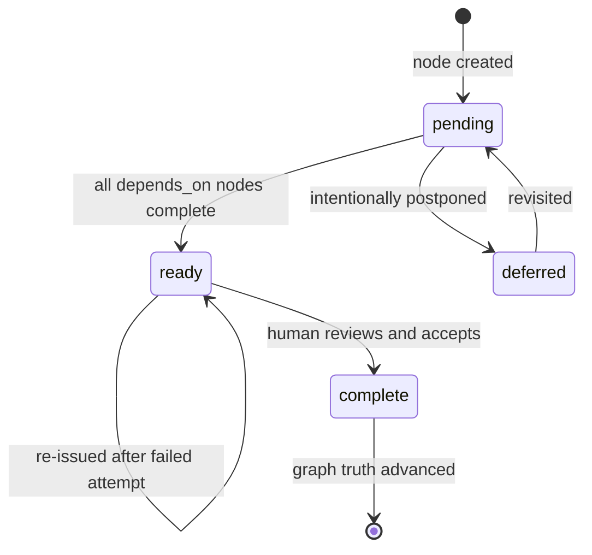
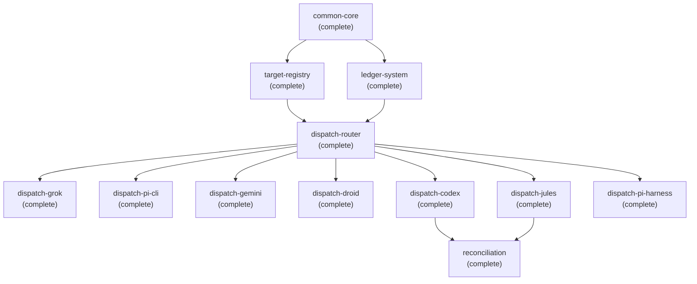

# Graph engine

The graph engine is the organizational backbone of gddp-config. Each project is a directory under `graphs/` containing a `project.yaml` file and a `nodes/` folder of individual node YAML files. The graph is the source of truth for what a project is and what work it contains. Agents do not modify the graph. Humans do.

## project.yaml structure

Every project has a `project.yaml` at `graphs/<project-id>/project.yaml`. The file uses the `project_graph` schema type and has three main sections: blueprint, nodes index, and execution policy.

### Blueprint

The blueprint section defines the project's identity and high-level shape:

```yaml
blueprint:
  vision: A one-sentence statement of what this project is
  architecture_notes: |
    Key constraints that shape the whole project. Multi-line free text.
  major_capabilities:
    - a list of the main capabilities the project will deliver
```

For example, `graphs/vault-doctor/project.yaml` has the vision "A terminal-first tool that gives Obsidian vaults a health check and lets users act on the results" and lists six major capabilities from vault scanning through interactive triage.

### Nodes index

The `nodes` key is a list of node summaries for human navigation. The system reads the `nodes/` directory directly for full node data, so this index is a convenience overview, not the authoritative source:

```yaml
nodes:
  - id: common-core
    title: Implement shared aa path, init, and packet validation helpers
    status: complete
    type: capability
```

Each entry has `id`, `title`, `status`, and `type`. The `project validate` command cross-checks this index against the actual `nodes/*.yaml` files to catch drift (nodes listed in project.yaml but missing on disk, or vice versa).

### Execution policy

The `execution_policy` section controls how the runtime treats this project:

```yaml
execution_policy:
  default_executor: jules
  max_concurrent_jobs: 1
  require_human_review_before_overnight: true
  artifact_gate_enforced: true
```

- `default_executor`: which executor to use when a node does not specify one
- `max_concurrent_jobs`: concurrency limit (starts at 1, increases after first successful mission)
- `require_human_review_before_overnight`: whether a human must sign off before overnight autonomous runs
- `artifact_gate_enforced`: whether the artifact verification gate is active

## Node dependency graph

Each node YAML file in `graphs/<project>/nodes/<node-id>.yaml` declares its relationships through two fields:

- `depends_on`: list of node ids that must be `complete` before this node can be verified. A node with `depends_on: []` has no prerequisites.
- `unlocks`: list of node ids that this node makes available. This is the forward edge: when this node completes, the listed nodes become eligible.

The validation engine checks that `depends_on` references point to nodes that exist in the same project (dangling references produce warnings), and that `unlocks` edges are symmetric: if node A lists B in `unlocks`, then B should list A in `depends_on`. Asymmetric edges produce warnings.

For example, in `graphs/aa-cli/nodes/common-core.yaml`:

```yaml
depends_on: []
unlocks:
  - target-registry
  - ledger-system
```

And in `graphs/aa-cli/nodes/dispatch-router.yaml`:

```yaml
depends_on:
  - target-registry
  - ledger-system
unlocks:
  - dispatch-grok
  - dispatch-pi-cli
  - dispatch-gemini
  - dispatch-droid
  - dispatch-codex
  - dispatch-jules
  - dispatch-pi-harness
```

This creates a chain: `common-core` unlocks `target-registry` and `ledger-system`, which `dispatch-router` depends on, which in turn unlocks all the individual dispatch targets.

## Node status flow

Node status is a human-owned decision on graph truth. It is not execution state. The runtime issues verdicts, but only a human advances status. The four status values are:

- `pending`: the node exists but its prerequisites are not yet met
- `ready`: all dependencies are complete, the node can be issued
- `complete`: a human has reviewed and accepted the node, graph truth has advanced
- `deferred`: the node is intentionally postponed

Execution states (`running`, `failed`) live on the job and queue_record schemas, not on the node.



The verification harness uses dependency status to determine if a node is `blocked`: if any `depends_on` node is not `complete` (or `unknown`, meaning the reference is external), the verdict is `blocked` rather than `fail`.

## Node types

Each node has a `type` field with three allowed values:

- **capability**: a system behavior that must exist. This is the most common type. All nodes in `graphs/aa-cli/` and `graphs/vault-doctor/` are capabilities.
- **milestone**: a checkpoint that groups capabilities. Used to mark significant project phases.
- **constraint**: a rule that scopes other nodes. Not directly executable.

## Template

New projects start from `graphs/_template/project.yaml`, which contains `REPLACE_ME` placeholders for every field. The `project new` CLI command can create a project from this template, from a markdown outline (`--from-outline`), or from a graphify AST output (`--from-graphify`). The template is skipped by both the validation engine and the node file iterator.

## Project graph example

The `graphs/aa-cli/` project has 12 nodes forming a dependency chain. `common-core` is the foundation with no dependencies. It unlocks `target-registry` and `ledger-system`, which together unlock `dispatch-router`, which unlocks six individual dispatch targets (`dispatch-grok`, `dispatch-pi-cli`, etc.). Finally, `reconciliation` depends on `dispatch-codex` and `dispatch-jules`. All 12 nodes are `complete`, representing a finished graph.



## Key source files

| File | What it contains |
|---|---|
| `graphs/_template/project.yaml` | Copy-and-replace template for new projects |
| `graphs/aa-cli/project.yaml` | AA CLI project: 12 nodes, all complete |
| `graphs/vault-doctor/project.yaml` | Vault Doctor project: 7 nodes, all complete |
| `graphs/gddp-runtime/project.yaml` | GDDP Runtime project: 13 nodes, mixed statuses |
| `graphs/sell-valuables/project.yaml` | Sell Valuables project: 10 nodes, all pending |
| `graphs/album-production/project.yaml` | Album Production project |
| `schemas/v1/node.yaml` | Node schema defining the node document shape |

## Related pages

- [schemas.md](schemas.md): The schema system that defines the node and project_graph shapes
- [validation-engine.md](validation-engine.md): How node YAMLs are validated against schema rules
- [verification-harness.md](verification-harness.md): How node acceptance criteria are evaluated
- [projects/index.md](../projects/index.md): The five managed project graphs
- [overview/architecture.md](../overview/architecture.md): System architecture with Mermaid diagrams
