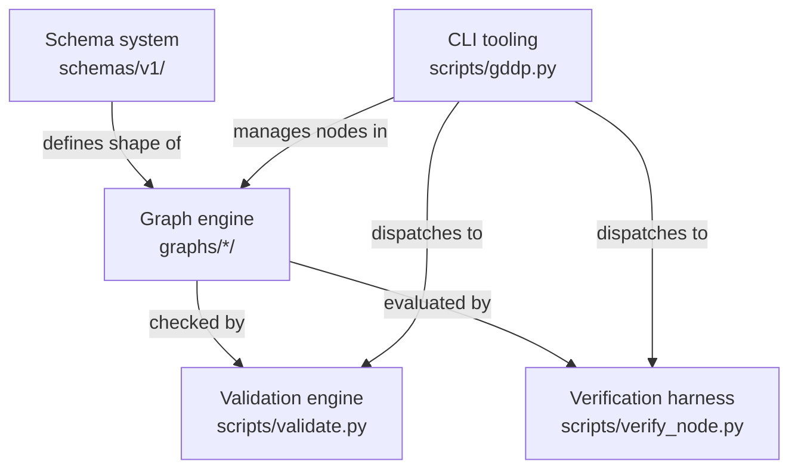

# Systems

The gddp-config repository is built from five internal systems that work together to define, validate, verify, and manage project graphs. Each system is a distinct layer with a clear boundary. This page gives a one-paragraph overview of each and links to the dedicated page.

## Schema system

The schema system lives in `schemas/v1/` and defines eight YAML schemas that specify the shape of every document in GDDP: nodes, events, jobs, results, queue records, artifact verifications, task packets, and shape profiles. Every schema file uses a shared envelope pattern (`schema_version` + `schema_type`) and embeds enum constraints, controlled vocabularies, and inline comments that serve as the canonical documentation for that domain object. The schemas are not parsed by a library at runtime; they are human-readable contracts that the validation engine mirrors as Python constants. See [schemas.md](schemas.md).

## Graph engine

The graph engine is the organizational backbone: each project is a directory under `graphs/` containing a `project.yaml` (the blueprint, node index, and execution policy) and a `nodes/` folder of individual node YAML files. Nodes form a dependency graph through `depends_on` and `unlocks` fields, and each node carries a human-owned status (`pending`, `ready`, `complete`, `deferred`) that represents graph truth, not execution state. The graph is the source of truth. Agents do not modify it. See [graph-engine.md](graph-engine.md).

## Validation engine

The validation engine is `scripts/validate.py`, a strict global validator that walks every node YAML across all projects (skipping `graphs/_template/`) and checks schema compliance, enum values, cross-references, id/filename matching, kebab-case formatting, list-of-strings integrity, and node id uniqueness. It supports several output modes (default, `--json`, `--strict`, `--quiet`, `--project`) and returns exit code 1 on any error. The validator mirrors schema constants inline rather than parsing schema files, keeping it self-contained. See [validation-engine.md](validation-engine.md).

## Verification harness

The verification harness is `scripts/verify_node.py`, a deterministic, no-LLM, no-network evaluation tool that runs acceptance criteria probes against a project's source repo checkout and emits a transparent receipt (`result.json` + `transcript.md`). Each acceptance criterion id maps to a registered probe (symbol presence, function definition, path existence, tier distinctness, human review, or project policy), and constraints are scanned for forbidden patterns. The harness produces one of six verdicts and classifies uncertainty into structured mismatch kinds, missing evidence, and human review questions. Receipts are stored in `verification-runtime/` (archived) and `verification-runtime-live/` (current live runs). See [verification-harness.md](verification-harness.md).

## CLI tooling

The CLI tooling centers on `scripts/gddp.py`, a unified entry point with four subcommand groups: `node` (new, rapid, batch, import, validate, list, status), `verify` (node), `obsidian` (export), and `project` (new, validate). Each subcommand uses a module dispatch pattern (`_import_module`) that dynamically imports the relevant script from `scripts/` and delegates execution to its `main()` function. This keeps `gddp.py` thin while individual scripts remain independently runnable. See [cli-tooling.md](cli-tooling.md).

## How the systems relate

The schema system defines what valid documents look like. The graph engine holds the actual project data conforming to those schemas. The validation engine checks graph data against schema rules. The verification harness evaluates whether a node's acceptance criteria are met in the source repo. The CLI tooling provides the human-facing interface to all of these.

## Related pages

- [overview/architecture.md](../overview/architecture.md): System architecture with Mermaid diagrams
- [primitives/index.md](../primitives/index.md): Foundational domain objects (8 schema types)
- [projects/index.md](../projects/index.md): The five managed project graphs
- [overview/getting-started.md](../overview/getting-started.md): Install, validate, scaffold
