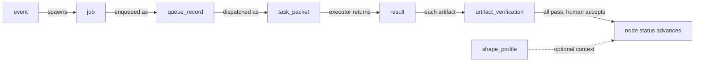

# Schema system

The schema system in `schemas/v1/` defines the shape of every document in GDDP. There are eight schema files, one per domain object. Each file is a YAML document that serves as both a human-readable contract and a worked example with inline comments explaining every field, enum value, and controlled vocabulary.

## Envelope pattern

Every schema file starts with the same two fields:

```yaml
schema_version: "1.0"
schema_type: <type-name>
```

This envelope identifies which schema a document conforms to. The `schema_type` value matches the schema filename (e.g., `schemas/v1/node.yaml` has `schema_type: node`). The validation engine checks this envelope on every node YAML it processes, and the graph engine uses `schema_type: project_graph` for `project.yaml` files.

## The eight schemas

### node (`schemas/v1/node.yaml`)

The central domain object. A node is a capability, milestone, or bounded project state that a human authors. Key fields:

- `node_id`: kebab-case identifier that must match the filename stem
- `type`: `capability` | `milestone` | `constraint`
- `why`: the reason this node exists (human-authored rationale)
- `depends_on`: list of node ids that must be complete before this node can proceed
- `acceptance_criteria`: list of `{id, criterion}` pairs that the evaluator judges
- `constraints`: list of strings scoping what the implementation may do
- `allowed_execution_modes`: subset of `jules` | `vertex` | `pi_worker` | `vm_worker` | `human`
- `required_artifacts`: artifacts that must exist before the node advances (e.g., `decision.md`, `result-summary.md`, `patch.diff`, `graph-update.yaml`, `merged_pr`)
- `status`: `pending` | `ready` | `complete` | `deferred` (human-owned graph truth, not execution state)
- `priority`: `low` | `medium` | `high` | `critical`
- `unlocks`: list of node ids that this node makes available

### event (`schemas/v1/event.yaml`)

An event is "something happened." GitHub webhook payloads are normalized into this format before any routing. Key fields:

- `event_id`, `received_at`, `source` (`github` | `transcript` | `manual`)
- `event_type`: controlled vocabulary of 12 values (`issue.opened`, `pull_request.opened`, `push.branch_updated`, `workflow.failed`, `manual.triggered`, `transcript.captured`, etc.)
- `project_node_candidates`: nodes the event might map to
- `scope_status`, `priority`, `risk_level`: each starts as `pending` and is resolved by the classifier
- `routing`: `selected_executor` and `selected_queue`
- `classification`: category, intent, and boolean flags for code execution, reasoning, and human review
- `raw_payload_path` and `normalized_payload_path`: filesystem pointers to the original and processed payloads

### job (`schemas/v1/job.yaml`)

A job is bounded work to perform. One event can create zero, one, or multiple jobs. Key fields:

- `job_id`, `created_at`, `event_id` (links back to the triggering event)
- `project_id`, `repo`, `node_id` (links to the graph)
- `job_type`: `implementation` | `review` | `reasoning` | `context_update`
- `executor`: `jules` | `vertex` | `pi_worker` | `vm_worker` | `human`
- `source_context`: repo source, starting/target branch, relevant paths, related PR/issue
- `constraints`: implementation guardrails (carried from the node)
- `acceptance_criteria`: references node acceptance ids plus local criteria
- `dependencies`: `node:<id>` references
- `status`, `attempt`, `max_attempts`: lifecycle tracking
- `artifacts_dir`, `result_summary_path`: output locations

### result (`schemas/v1/result.yaml`)

Every executor returns into this shared contract. Downstream stages do not care which executor produced the result. Key fields:

- `result_id`, `job_id`, `executor`, `received_at`, `execution_duration_seconds`
- `outcome`: `success` | `failure` | `partial` | `error`
- `status`: `completed` | `failed` | `needs_review`
- `changed_files`, `patch_path`, `summary_path`, `logs_path`: output artifacts
- `acceptance_check`: per-criterion-id verdict map (`pass` | `fail` | `untested`)
- `risks`, `followup_candidates`: forward-looking signals
- `github_action`: type (`comment_only` | `pr_update` | `open_pr` | `close_issue` | `none`) and target

### queue_record (`schemas/v1/queue_record.yaml`)

Minimal record stored in SQLite for job lifecycle tracking. Leasing prevents two workers from picking up the same job. Key fields:

- `queue_item_id`, `job_id`, `queue`: the queue state (see below)
- `available_at`, `lease_owner`, `lease_expires_at`: leasing metadata
- `retry_count`, `last_error`: failure tracking

Queue states: `intake`, `classified`, `blocked`, `ready`, `running`, `awaiting_result`, `awaiting_review`, `complete`, `failed`, `deferred`, `cancelled`.

### artifact_verification (`schemas/v1/artifact_verification.yaml`)

One record per artifact, per job. All `required_artifacts` in a node must verify before the node advances. This is a hard gate. Key fields:

- `verification_id`, `job_id`, `node_id`, `artifact_type`
- `validation_method`: `file_exists` | `content_check` | `github_api_check` | `human_audit`
- `verified`: boolean
- `verified_by`: `runtime_validator` | `human` | `codex_reviewer`
- `notes`: free-text explanation

### task_packet (`schemas/v1/task_packet.yaml`)

The exact payload constructed before dispatching to an executor. Archived in the job's artifacts folder regardless of outcome. Key fields:

- `task_packet_id`, `job_id`, `executor` (`jules` | `codex` | `vertex` | `vm_worker`)
- `prompt`: a multi-line string containing the goal, why, constraints, acceptance criteria, relevant paths, related context, and output requirements
- `repo_source`, `starting_branch`: execution context

### shape_profile (`schemas/v1/shape_profile.yaml`)

A shape profile encodes what a project type should look like structurally. Profiles are optional context for the semantic verification agent. They do not mutate graph truth. Key fields:

- `profile_id`, `description`
- `expected_node_chain`: ordered list of expected node phases (e.g., `spec`, `implementation`, `tests`)
- `invariant_rules`: rules that must hold (e.g., "Graph legality must be preserved")
- `anti_patterns`: patterns that must not occur (e.g., "Runtime silently mutates source graph")

## Enum constraints

Each schema defines controlled vocabularies inline. These are not enforced by a schema parser at runtime. Instead, the validation engine (`scripts/validate.py`) mirrors the key enums as Python constants and checks them directly. The main enums are:

| Field | Allowed values |
|---|---|
| `node.type` | `capability`, `milestone`, `constraint` |
| `node.status` | `pending`, `ready`, `complete`, `deferred` |
| `node.priority` | `low`, `medium`, `high`, `critical` |
| `node.allowed_execution_modes` | `jules`, `vertex`, `pi_worker`, `vm_worker`, `human` |
| `event.source` | `github`, `transcript`, `manual` |
| `event.event_type` | 12 controlled values (see schema file) |
| `job.job_type` | `implementation`, `review`, `reasoning`, `context_update` |
| `result.outcome` | `success`, `failure`, `partial`, `error` |
| `queue_record.queue` | 11 states (intake through cancelled) |
| `artifact_verification.validation_method` | `file_exists`, `content_check`, `github_api_check`, `human_audit` |

## How schemas relate to each other

The schemas form a pipeline. An event arrives and is normalized. The event spawns one or more jobs. Each job is enqueued as a queue record. When dispatched, the job becomes a task packet sent to an executor. The executor returns a result. Each artifact in the result is verified via an artifact verification record. When all criteria pass and artifacts verify, the node's status advances in the graph (a human decision). Shape profiles sit alongside this pipeline as optional structural context.



## Key source files

| File | What it defines |
|---|---|
| `schemas/v1/node.yaml` | Node schema: capabilities, milestones, constraints with acceptance criteria and dependency edges |
| `schemas/v1/event.yaml` | Event schema: normalized webhook payloads with classification and routing |
| `schemas/v1/job.yaml` | Job schema: bounded work units with source context and acceptance references |
| `schemas/v1/result.yaml` | Result schema: executor output contract with acceptance check and followup signals |
| `schemas/v1/queue_record.yaml` | Queue record schema: SQLite lifecycle tracking with leasing |
| `schemas/v1/artifact_verification.yaml` | Artifact verification schema: per-artifact gate with validation methods |
| `schemas/v1/task_packet.yaml` | Task packet schema: exact executor dispatch payload |
| `schemas/v1/shape_profile.yaml` | Shape profile schema: optional structural expectations for project types |

## Related pages

- [primitives/index.md](../primitives/index.md): Foundational domain objects (8 schema types)
- [validation-engine.md](validation-engine.md): How schema constants are enforced
- [graph-engine.md](graph-engine.md): How node schemas manifest in project graphs
- [overview/glossary.md](../overview/glossary.md): GDDP vocabulary
