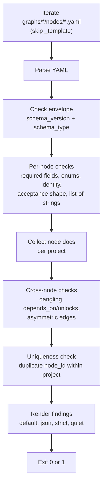

# Validation engine

The validation engine is `scripts/validate.py`, a strict global validator for gddp-config node YAML files. It walks every `graphs/*/nodes/*.yaml` file (skipping `graphs/_template/`) and checks each one against the schema documented in `schemas/v1/node.yaml`. The validator is self-contained: schema constants are mirrored inline as Python constants rather than parsed from the schema files at runtime.

## What it checks

The validator performs the following checks on every node YAML file:

### Envelope

- `schema_version` must be `"1.0"`
- `schema_type` must be `"node"`

### Required fields and types

The validator checks that all 12 required fields are present and have the correct Python type:

| Field | Expected type |
|---|---|
| `node_id` | str |
| `title` | str |
| `type` | str |
| `why` | str |
| `depends_on` | list |
| `acceptance_criteria` | list |
| `constraints` | list |
| `allowed_execution_modes` | list |
| `required_artifacts` | list |
| `status` | str |
| `priority` | str |
| `unlocks` | list |

Missing fields produce `missing_field` errors. Wrong types produce `type_error` errors.

### Enum values

The validator checks that `type`, `status`, `priority`, and `allowed_execution_modes` contain only values from their controlled vocabularies:

- `type`: `capability`, `milestone`, `constraint`
- `status`: `pending`, `ready`, `complete`, `deferred`
- `priority`: `low`, `medium`, `high`, `critical`
- `allowed_execution_modes`: subset of `jules`, `vertex`, `pi_worker`, `vm_worker`, `human`

Unknown values produce `type_enum`, `status_enum`, `priority_enum`, or `exec_mode_enum` errors.

### Artifact recognition

The validator warns (not errors) when `required_artifacts` contains values not in the known set (`decision.md`, `result-summary.md`, `patch.diff`, `graph-update.yaml`, `merged_pr`). This is forward-compatible: new artifact types produce warnings, not hard failures.

### Identity: node_id matches filename, kebab-case

The `node_id` must match the filename stem. For example, a file named `common-core.yaml` must have `node_id: common-core`. Mismatches produce `id_filename_mismatch` errors. The `node_id` must also be kebab-case (matching `^[a-z][a-z0-9]*(-[a-z0-9]+)*$`). Non-conforming ids produce `id_format` errors.

### Acceptance criteria shape

The `acceptance_criteria` field must be a non-empty list where each entry is a dict with `id` (kebab-case string) and `criterion` (string). The validator checks:

- `acceptance_type`: must be a list
- `acceptance_empty`: must have at least one entry
- `acceptance_shape`: each entry must be a dict with both `id` and `criterion` keys
- `acceptance_id_type` and `acceptance_id_format`: id must be a kebab-case string
- `acceptance_criterion_type`: criterion must be a string

### List-of-strings integrity

Five fields (`depends_on`, `unlocks`, `constraints`, `allowed_execution_modes`, `required_artifacts`) must be lists containing only strings. A common YAML mistake is an unquoted colon mid-item, which YAML parses as a single-key dict instead of a string. The validator detects this and produces an `implicit_mapping_in_list` warning with a suggested quoted form. Non-string, non-dict items produce `list_of_strings` errors.

### Cross-node references

After validating each node individually, the validator performs cross-node checks within each project:

- `dangling_depends_on`: a `depends_on` reference that points to a node id not found in the project (warning)
- `dangling_unlocks`: an `unlocks` reference that points to a node not found in the project (warning, may be a future node)
- `asymmetric_edge`: node A lists B in `unlocks` but B does not list A in `depends_on` (warning)

### Uniqueness

- `duplicate_id`: the same `node_id` appearing in two different files within the same project (error)

## Finding dataclass

Every check result is a `Finding` dataclass:

```python
@dataclass
class Finding:
    path: str       # repo-relative file path
    line: int       # best-effort line number, 0 if unknown
    severity: str   # "error" or "warning"
    rule: str       # machine-readable rule name (e.g., "id_filename_mismatch")
    message: str    # human-readable explanation
```

Findings are collected into a flat list and rendered in the selected output mode.

## Modes

| Mode | Flag | Behavior |
|---|---|---|
| Default | (none) | Human-readable: one line per finding, summary at the bottom |
| JSON | `--json` | Machine-readable JSON with `errors`, `warnings`, and `summary` objects. Used by `new_node.py` post-write hook. |
| Strict | `--strict` | Warnings count as errors. Exit code 1 if any warning exists. |
| Quiet | `--quiet` | Only prints a summary line: `errors=N warnings=N` |
| Project | `--project <id>` | Only check nodes in the specified project |

Flags can be combined (e.g., `--json --strict`, `--project vault-doctor --quiet`).

## Exit codes

| Condition | Exit code |
|---|---|
| No errors (and no warnings, or warnings in non-strict mode) | 0 |
| Any errors | 1 |
| Any warnings in `--strict` mode | 1 |

## Usage

```bash
# Human-readable report across all projects
.venv/bin/python scripts/validate.py

# Machine-readable JSON
.venv/bin/python scripts/validate.py --json

# Only check one project
.venv/bin/python scripts/validate.py --project vault-doctor

# Treat warnings as errors
.venv/bin/python scripts/validate.py --strict

# Summary only
.venv/bin/python scripts/validate.py --quiet

# Override repo root
.venv/bin/python scripts/validate.py --root /path/to/gddp-config
```

The validator can also be invoked through the unified CLI: `gddp node validate`.

## Validation flow

The validator runs in three phases: per-node checks, cross-node checks, and uniqueness checks. The following diagram shows the flow:



## Key source files

| File | What it does |
|---|---|
| `scripts/validate.py` | Strict global validator: schema compliance, enums, cross-refs, identity, uniqueness |
| `schemas/v1/node.yaml` | Node schema (source of truth that validate.py mirrors inline) |
| `scripts/gddp.py` | Unified CLI that delegates to validate.py via `node validate` subcommand |
| `scripts/test_compliance.py` | Compliance tests for the validator |

## Related pages

- [schemas.md](schemas.md): The schema system that defines the rules validate.py enforces
- [graph-engine.md](graph-engine.md): The project graphs that validate.py checks
- [cli-tooling.md](cli-tooling.md): The unified CLI that dispatches to validate.py
- [overview/getting-started.md](../overview/getting-started.md): Install, validate, scaffold
- [how-to-contribute/patterns-and-conventions.md](../how-to-contribute/patterns-and-conventions.md): Coding patterns and conventions
