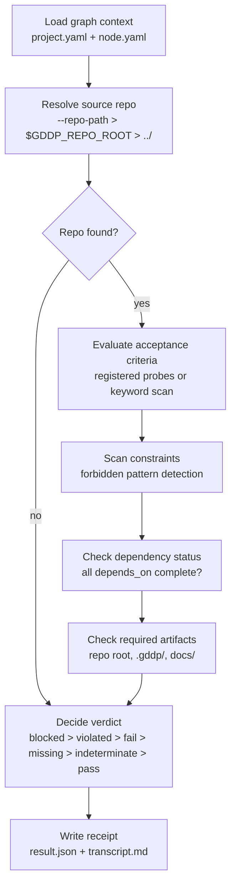

# Verification harness

The verification harness is `scripts/verify_node.py`, a deterministic node evaluation tool that runs acceptance criteria probes against a project's source repo checkout and emits a transparent receipt. It is deterministic, repeatable, uses no LLM, and makes no network calls. Semantic evaluation (judgment about meaning) remains a separate, later layer. This harness only records what the deterministic layer can prove.

## Deterministic evaluation flow

The harness follows a fixed sequence for each verification run:

1. **Load graph context**: reads `graphs/<project>/project.yaml` and `graphs/<project>/nodes/<node>.yaml`
2. **Resolve source repo**: finds the local checkout of the project's source repo (see below)
3. **Evaluate acceptance criteria**: for each criterion in the node's `acceptance_criteria`, runs a registered probe or falls back to a keyword scan
4. **Scan constraints**: for each constraint string, scans referenced source files for forbidden patterns
5. **Check dependency status**: reads the project graph to see if all `depends_on` nodes are `complete`
6. **Check required artifacts**: looks for each artifact in the repo root, `.gddp/`, and `docs/`
7. **Decide verdict**: combines all results into a single verdict with confidence and a required next action
8. **Write receipt**: outputs `result.json` and `transcript.md`



## Acceptance criteria mapping

Each acceptance criterion id maps to a probe in the `CHECK_PROBES` dictionary in `scripts/verify_node.py`. The harness looks up probes in two steps: first by `"<node_id>:<criterion_id>"` (node-specific), then by `"<criterion_id>"` alone (shared). Probe types:

| Probe type | What it checks |
|---|---|
| `symbol` | One or more regex patterns must appear in named files. `all: true` requires every pattern; otherwise any match suffices. |
| `func` | A function definition `name()` must exist, plus body marker patterns. |
| `path` | A specific path must exist relative to repo root. Optionally grep for markers inside the file. |
| `paths` | Multiple paths must all exist. |
| `tier_distinct` | Parses `targets.conf` and checks that named tiers for a target resolve to distinct commands. Catches "speed tier equals default tier" problems. |
| `human_review` | Always returns `indeterminate`. Used for criteria that require a human decision the harness cannot make. |
| `project_policy` | Checks a project.yaml file for a policy marker (e.g., `require_human_review_before_overnight: true`). |
| `any_of` | Like `symbol` but requires any match (not all). |

When no probe is registered for a criterion id, the harness falls back to a keyword scan: it extracts identifiers from the criterion text, finds candidate source files based on the repo layout, and greps for those identifiers. If nothing matches, the check is `indeterminate`, not `fail`. This is conservative: absence of evidence does not equal failure.

## Constraint scanning

The harness scans source files referenced by the node's acceptance criteria probes and constraint text for forbidden patterns. Two forbidden pattern categories are built in:

1. Sourcing an executor-specific module (`grok`, `pi`, `gemini`, `droid`, `codex`, `jules`) from a common-layer `.zsh` file
2. Introducing a Python runtime dependency in a zsh lib (`python3` at start of line)

The constraint scan also checks preservation rules: for example, if a constraint mentions `targets.conf`, the scan verifies that `AA_TARGETS_CONF` still points at `targets.conf` in the source. Each constraint gets a status of `clear` or `violated`.

## Verdict types

The `decide_verdict()` function combines criteria results, constraint results, dependency status, and artifact presence into one of six verdicts:

| Verdict | Condition | Exit code |
|---|---|---|
| `pass` | All criteria pass, no constraint violations, all required artifacts present | 0 |
| `fail` | One or more criteria have status `fail` | 1 |
| `blocked` | One or more `depends_on` nodes are not `complete` | 1 |
| `out-of-scope-change-detected` | One or more constraints are `violated` | 1 |
| `needs-human-review` | Some criteria pass, some are indeterminate, artifacts present | 1 |
| `needs-more-evidence` | Missing artifacts, or all criteria indeterminate, or repo not found | 1 |

The verdict logic follows a priority order: blocked is checked first (dependencies gate everything), then constraint violations, then criteria failures, then missing artifacts, then indeterminate criteria.

## Source repo resolution

The project's `repo:` field (e.g., `skchaudr/vault-doctor`) tells the harness which source repo to evaluate. The harness resolves the local checkout in order:

1. `--repo-path` flag (explicit override)
2. `$GDDP_REPO_ROOT/<name>` environment variable
3. `../<name>` relative to the gddp-config root (sibling directory)

The first existing directory wins. If none exists, all criteria are marked `indeterminate` with method `repo_not_found` and the verdict is `needs-more-evidence`.

## Receipt format

Each verification run produces two files in `verification/<project>/<node>/`:

### result.json

A JSON document with the following top-level fields:

- `project_id`, `node_id`: identifiers
- `verdict`: one of the six verdict types
- `confidence`: float 0.0 to 1.0
- `criteria_checked`: list of `CriterionCheck` objects, each with `id`, `criterion`, `status` (`pass` | `fail` | `indeterminate`), `confidence`, `method`, `evidence`, `reasoning`, `mismatch_kind`, `mismatch_detail`, `needs_evidence`, `human_question`
- `constraints_checked`: list of `ConstraintCheck` objects with `constraint`, `status` (`clear` | `violated` | `indeterminate`), `confidence`, `method`, `evidence`, `reasoning`
- `files_inspected`: list of all files the harness looked at
- `commands_run`: list of `CommandRecord` objects with `command`, `exit_code`, `stdout_tail`
- `evidence_summary`: multi-line text summarizing all check results
- `reasoning_summary`: one-line summary of deps, criteria, constraints, and artifact counts
- `required_next_action`: human-readable instruction for what to do next
- `criteria_mismatches`: structured list of `{criterion_id, kind, detail}` for non-passing criteria with a mismatch classification
- `missing_evidence`: list of `{criterion_id, what_is_missing, what_exists}` for criteria where code exists but proof is absent
- `human_review_questions`: list of `{criterion_id, question}` for criteria that need a human decision

### transcript.md

A human-readable Markdown transcript with sections for reasoning summary, required next action, acceptance criteria (with method, reasoning, and evidence per criterion), constraints, files inspected, commands run, criteria mismatches, missing evidence, human review questions, and the full evidence summary.

## Mismatch classification

When a criterion does not pass, the harness classifies the kind of uncertainty using `mismatch_kind`:

- `wording`: the path exists but lacks expected markers
- `source_path`: expected files are not found in the repo
- `alias_integration`: alias targets do not resolve to the same command as the canonical target
- `tier_distinct`: required tiers resolve to identical commands instead of distinct variants
- `human_review`: the criterion requires a human decision

This classification lets the receipt say what kind of uncertainty a finding is, not just that it failed.

## verification-runtime/ vs verification-runtime-live/

The repository has two directories for verification receipts:

- `verification-runtime/`: archived receipts from past runs. These are historical records kept for audit and comparison. Contains receipts for `gddp-runtime` and `vault-doctor` projects.
- `verification-runtime-live/`: current live verification receipts. Contains the most recent run results for `gddp-runtime`, `vault-doctor`, and `aa-cli` projects.

Both directories use the same structure: `<project>/<node>/result.json`. The harness itself writes to `verification/` (without the `-runtime` suffix) by default, and receipts are then organized into the runtime directories as needed.

## Usage

```bash
# Basic verification
.venv/bin/python scripts/verify_node.py node --project vault-doctor --node scan-vault-core

# JSON output to stdout
.venv/bin/python scripts/verify_node.py node --project aa-cli --node common-core --json

# Override repo path
.venv/bin/python scripts/verify_node.py node --project aa-cli --node common-core --repo-path /path/to/aa-cli

# Via unified CLI
.venv/bin/python scripts/gddp.py verify node --project aa-cli --node common-core
```

## Key source files

| File | What it does |
|---|---|
| `scripts/verify_node.py` | Deterministic node evaluation harness: probes, constraint scan, verdict logic, receipt writer |
| `scripts/README.md` | CLI documentation covering verify subcommand and source repo resolution |
| `scripts/gddp.py` | Unified CLI that dispatches to verify_node.py via `verify node` subcommand |
| `verification-runtime/vault-doctor/scan-vault-core.json` | Example archived receipt (vault-doctor project) |
| `verification-runtime-live/gddp-runtime/pi-evaluator-harness.json` | Example live receipt (gddp-runtime project) |
| `verification-runtime-live/vault-doctor/scan-vault-core.json` | Example live receipt (vault-doctor project) |

## Related pages

- [graph-engine.md](graph-engine.md): How nodes and dependencies are structured
- [validation-engine.md](validation-engine.md): How node YAMLs are validated before verification
- [cli-tooling.md](cli-tooling.md): The unified CLI that dispatches to verify_node.py
- [schemas.md](schemas.md): The node schema that defines acceptance_criteria and constraints
- [overview/architecture.md](../overview/architecture.md): System architecture with Mermaid diagrams
